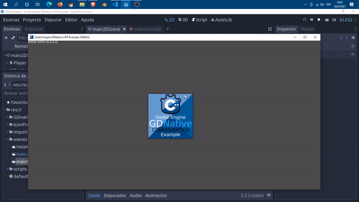
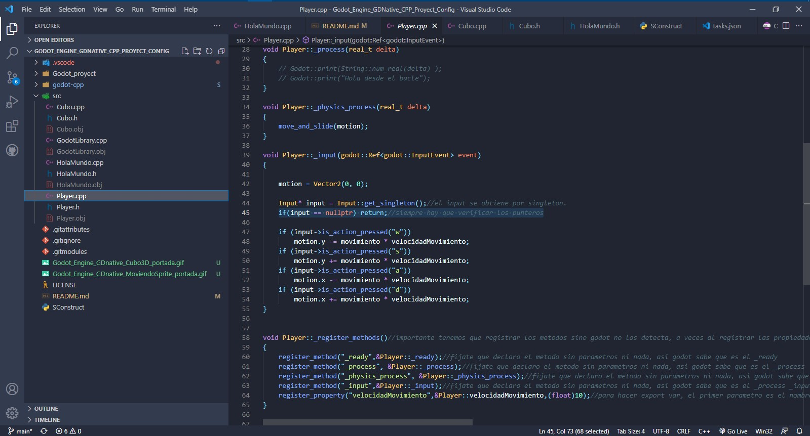

# Godot Engine GDNative C++ Proyect Config

¡Bienvenido al ejemplo de CPP GDNative de Godot Engine!
 En la carpeta src puede encontrar código repetitivo y una clase Player personalizada.
  ¡Puede usarlo para exportar sus propios archivos dll de Godot Engine con su código de juego! Actualización: 
  
  ¡Ahora hay Scons integrados y compatibilidad con vs-code! Pero también puedes usar solo el código fuente y tirar las otras cosas;

